# Architecture diagrams

Visual reference for onboarding, design reviews, and presentations. Narrative detail for each pipeline lives in [Data flow](data-flow.md); ownership rules in [Package boundaries](package-boundaries.md).

**Terminology:** XFlickr uses **manual crawl** only. The scheduler drains crawl targets the user already queued — it does not discover new subjects or auto-spider the web.

---

## End-to-end operator journey

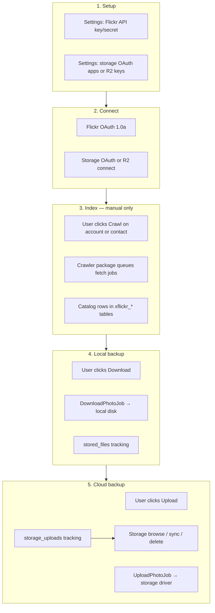

| Step | User action | Primary outcome |
|---|---|---|
| Setup | Configure credentials in Settings | MongoDB app profiles (`xflickr_app.*`, `storage_app.*`) |
| Connect | Authorize Flickr and storage accounts | Crawler `Connection` + MySQL `storage_accounts` |
| Index | Crawl contacts, photos, photosets, galleries, favorites | Catalog metadata in crawler tables |
| Local backup | Download selected or account photos | Files under `storage/app/private/flickr/` |
| Cloud backup | Upload to Google Photos, Drive, OneDrive, or R2 | Remote copies + browse UI |

---

## System context

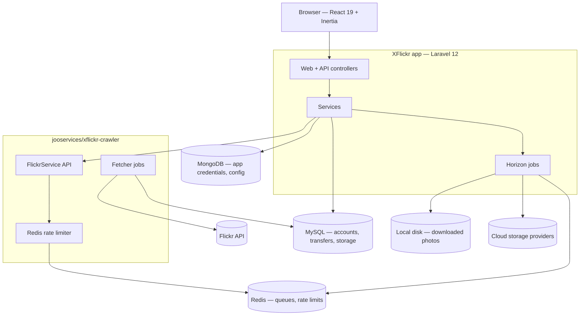

---

## Application layers

Backend code follows a single request lifecycle (see [Application standards](application-standards.md)):

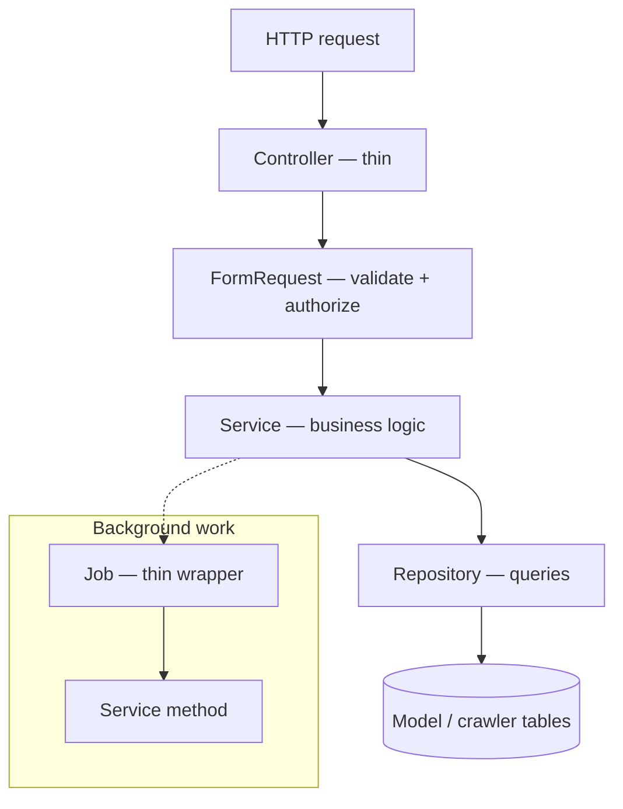

| Layer | Must not |
|---|---|
| Controller | Inline validation, direct `Model::query()` |
| Job | Own orchestration — delegate to Services |
| Service | Write crawler tables via raw SQL — use package API |

---

## Package boundaries

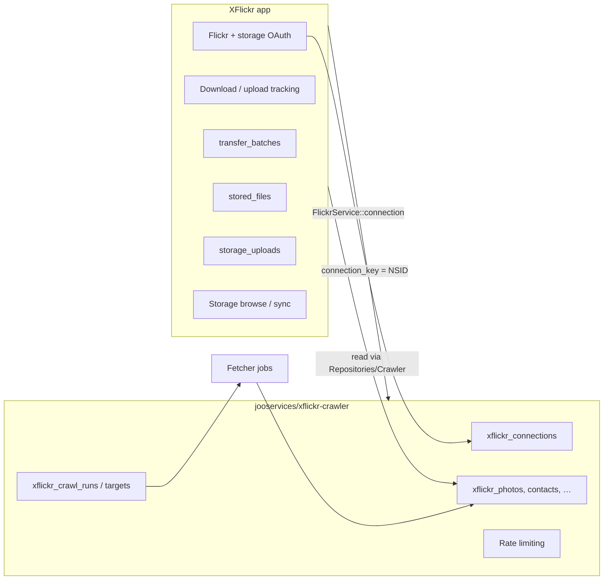

Bridge field: **`connection_key`** (typically the Flickr account NSID). App controllers pass crawler `Connection` models into Services; crawls call `FlickrCrawlService` → `FlickrService` from the package.

---

## Manual crawl pipeline

Nothing crawls until a user clicks **Crawl**. The scheduler only drains existing targets.

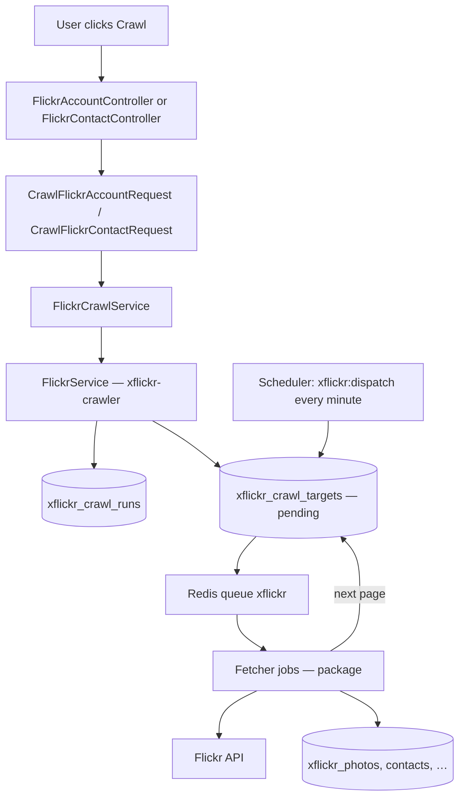

**Crawl types:** contacts, photos, photosets, galleries, favorites.

**Not auto-spidering:** `xflickr:dispatch` does not create targets — it locks and dispatches targets already written by a user-triggered crawl.

Monitor progress: [Operations](../02-user-guide/operations.md), [Dashboard](../02-user-guide/dashboard.md), Horizon.

---

## Download pipeline

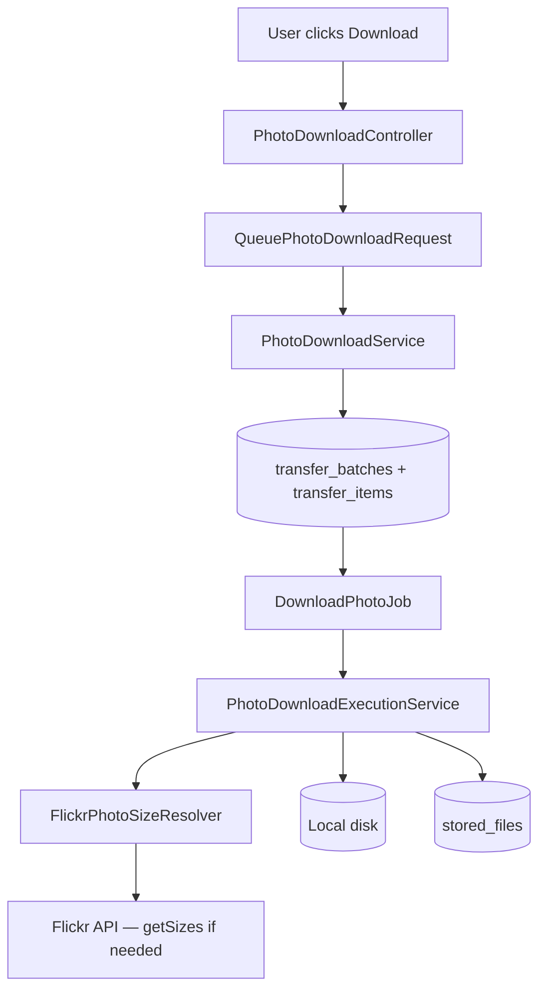

**Dedup:** skip when `stored_files.local_downloaded_at` is set for the `flickr_photo_id`.

**Queue:** `xflickr-downloads` (dedicated Horizon supervisor).

---

## Upload pipeline

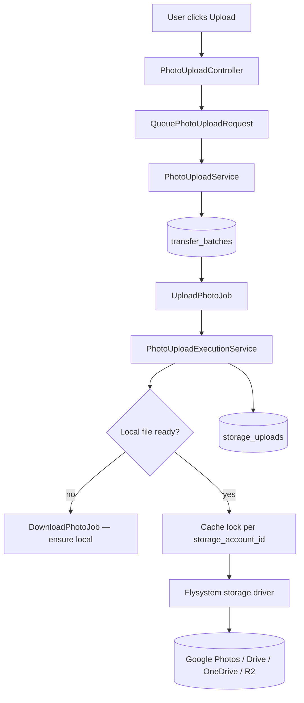

**Dedup:** skip when `storage_uploads` exists for `(flickr_photo_id, storage_account_id)`.

**Concurrency:** `xflickr-uploads` supervisor runs with limited `maxProcesses` to avoid hammering cloud APIs.

---

## Storage browse and sync

After uploads, operators browse remote content under `/storages/*`.

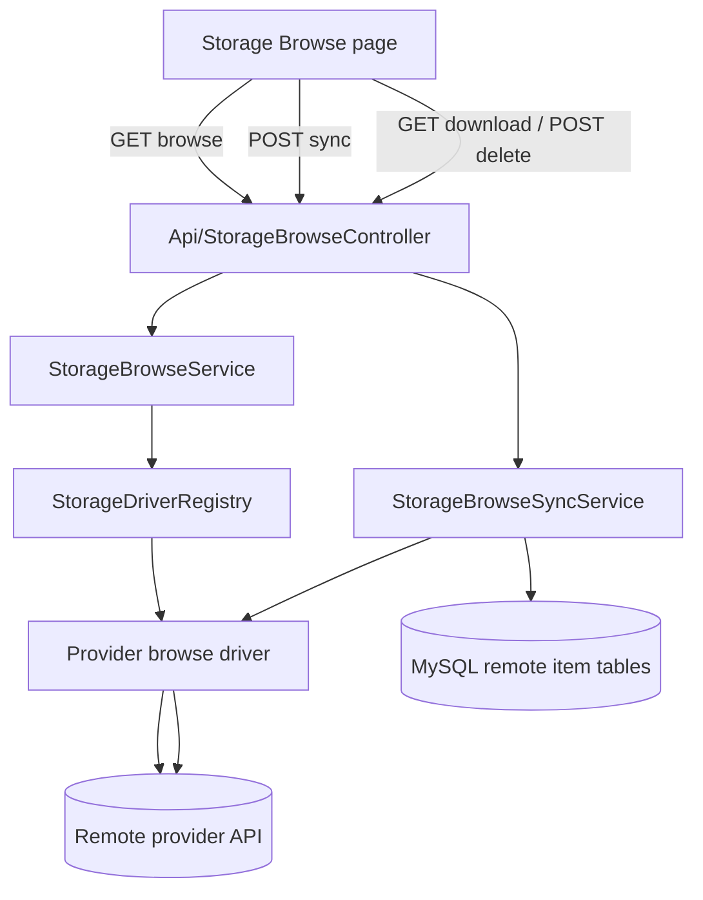

| Provider | Browse scope |
|---|---|
| Google Photos | App-created uploads only |
| Google Drive | App-created files |
| OneDrive | Connected account |
| Cloudflare R2 | Configured bucket |

Credentials: OAuth tokens in MySQL `storage_accounts.credentials` (encrypted); R2 uses API keys from Settings (MongoDB profile).

---

## Flickr OAuth and connection sync

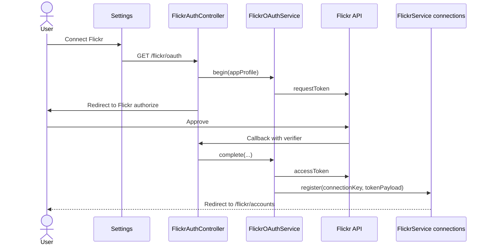

App credentials (`xflickr_app.*`) live in MongoDB via laravel-config. Connected tokens are stored on crawler `Connection` records (`token_payload`), keyed by NSID.

---

## Storage connect

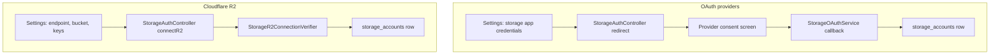

---

## Queue and Horizon topology

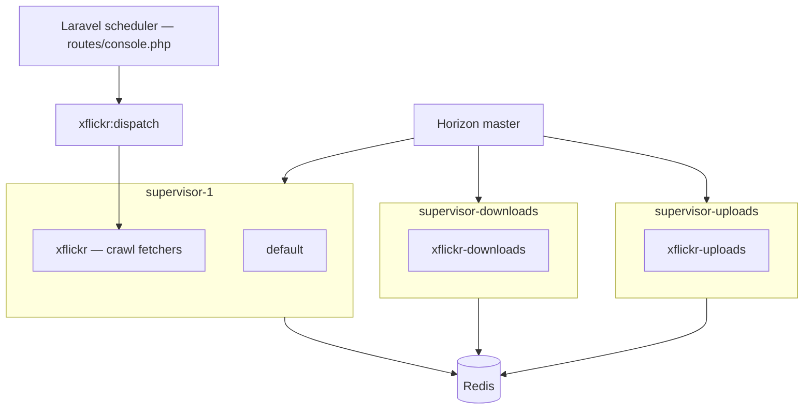

| Queue | Typical jobs | Notes |
|---|---|---|
| `xflickr` | Crawler fetcher jobs | Drained by `xflickr:dispatch` |
| `xflickr-downloads` | `DownloadPhotoJob` | Longer timeout (180s) |
| `xflickr-uploads` | `UploadPhotoJob` | Limited concurrency; lock per storage account |

Dashboard: `/horizon`. See [Horizon](../03-operations/horizon.md).

---

## Data stores

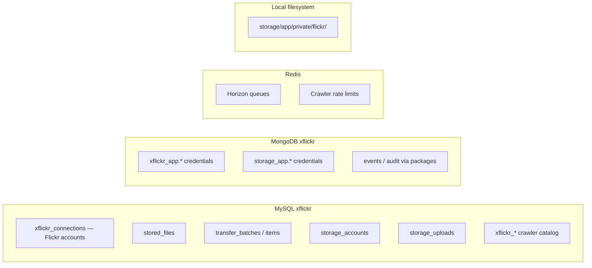

| Store | Examples |
|---|---|
| MySQL | Transfers, storage metadata, crawler catalog |
| MongoDB | Flickr/storage **app** credentials (not user tokens) |
| Redis | Job queues, API quota counters |
| Local disk | Downloaded photo bytes |

---

## Module map (code layout)

Quick reference when navigating the repo — full tree in [Repository structure](repository-structure.md).

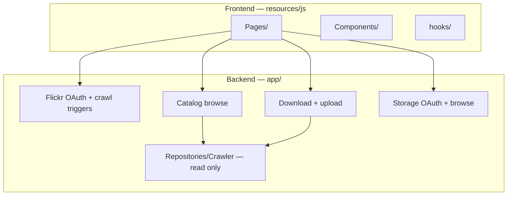

---

## Related documentation

| Topic | Document |
|---|---|
| Pipeline step-by-step | [Data flow](data-flow.md) |
| App vs crawler ownership | [Package boundaries](package-boundaries.md) |
| Folder and controller map | [Repository structure](repository-structure.md) |
| Backend layering rules | [Application standards](application-standards.md) |
| Stack versions | [Tech stack](tech-stack.md) |
| Operator UI | [User guide](../02-user-guide/dashboard.md) |
| Crawler package | `vendor/jooservices/xflickr-crawler/docs/` |
