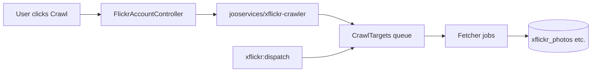
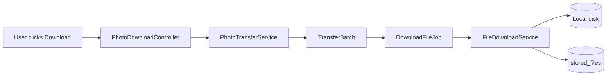
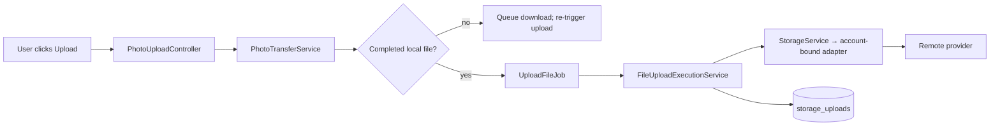

# Data flow

For presentation-ready diagrams (end-to-end journey, OAuth, queues, storage browse), see [Architecture diagrams](architecture-diagrams.md).

## Crawl pipeline

1. User triggers crawl from Flickr account or contact page.
2. Controller validates input via FormRequest and calls crawler package API.
3. Crawler creates `CrawlRun` and `CrawlTarget` records.
4. Scheduler command `xflickr:dispatch` (every minute) drains pending targets.
5. Fetcher jobs call Flickr API and persist catalog rows.

**Nothing crawls automatically** — targets exist only after user action.

## Download pipeline

- Deduplication: skip completed original rows in `stored_files` by `source_id`.
- Flickr-owned `FlickrPhotoSourceService` resolves direct download URLs.

## Upload pipeline

- Upload queue runs with limited concurrency (Horizon supervisor).
- Completed `(stored_file_id, storage_account_id)` uploads are idempotent.

## Settings and credentials

| Credential type | Storage |
|---|---|
| Flickr API key/secret | MongoDB via laravel-config (`xflickr_app.*`) |
| Storage OAuth clients | MongoDB (`storage_app.*`) |
| Connected Flickr tokens | MySQL `flickr_accounts.token_payload` (encrypted) |
| Connected storage tokens | MySQL `storage_accounts.credentials` (encrypted) |
