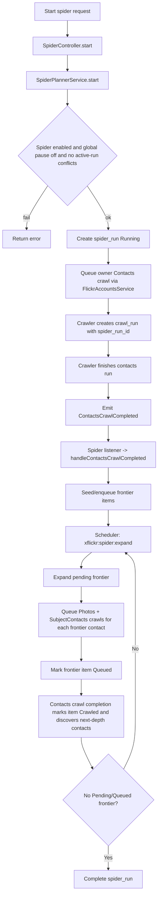
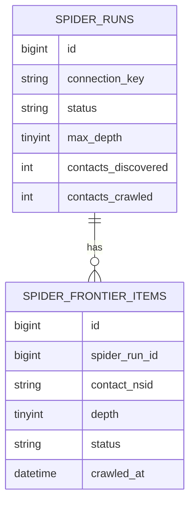
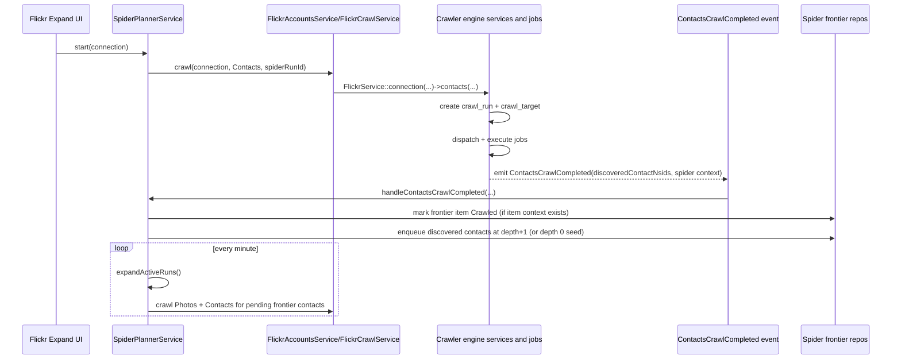

# Crawler & Spider module architecture audit

Date: 2026-07-16  
Scope: `Modules/Crawler` and `Modules/Spider` (+ direct integration points)

## 1) Executive summary

`Crawler` is the crawl execution engine (runs, targets, queue dispatch, Flickr fetchers, persistence).  
`Spider` is an opt-in orchestration layer that plans multi-hop contact expansion by creating more `Crawler` runs over time.

The two modules are coupled through an explicit event bridge and context fields:

- `Crawler` emits `ContactsCrawlCompleted`
- `Spider` listens and updates `spider_runs` / `spider_frontier_items`
- `Crawler` `crawl_runs` store `spider_run_id` + `spider_frontier_item_id` to maintain traceability

This is a clean planner/engine split: Spider does not execute Flickr API fetchers itself; it delegates to Crawler through Flickr services.

---

## 2) Usage audit — Crawler module

## 2.1 What Crawler owns

From source:

- Crawl run/target lifecycle (`CrawlRun`, `CrawlTarget`)
- Queue dispatch service (`FlickrSpiderService::dispatchDueTargets`)
- Crawl entry service (`CrawlingService`)
- Job execution (`FetchCrawlPageJob`, `AbstractXFlickrCrawlJob`, `InteractsWithXFlickrCrawlJob`)
- Fetcher mapping (`TaskType` -> fetcher class + API method)
- Catalog persistence (contacts/photos/photosets/galleries/favorites)
- API rate limit and outcome handling
- Events: `CrawlRunCompleted`, `CrawlPageFailed`, `ContactsCrawlCompleted`
- CLI commands:
  - `xflickr:dispatch`
  - `xflickr:doctor`
  - `xflickr:prune`

## 2.2 Who uses Crawler

| Consumer | Usage |
|---|---|
| `Modules/Flickr` | `FlickrCrawlService` delegates crawl requests to `FlickrService::connection(...)->contacts/photos/...` |
| `Modules/Spider` | `SpiderPlannerService` calls `FlickrAccountsService::crawl(...)` which lands in Crawler |
| `Modules/Contacts` | Full-pass planner also listens to `ContactsCrawlCompleted` |
| `Modules/Operations` | Listens to crawl events and reads crawl status for dashboard/stream |
| Scheduler | `routes/console.php` runs `xflickr:dispatch` every minute |
| Horizon queue | Crawler jobs run on queue `xflickr` |

## 2.3 Crawler process flow

```mermaid
flowchart TD
  A[User action: Crawl] --> B[Flickr module service]
  B --> C[Crawler facade: FlickrService::connection(...)]
  C --> D[CrawlingService]
  D --> E[FlickrSpiderService.createRun]
  E --> F[Insert crawl_run]
  E --> G[Insert page-1 crawl_target]
  D --> H[dispatchDueTargets]
  H --> I[Lock due targets]
  I --> J[Dispatch FetchCrawlPageJob to xflickr queue]
  J --> K[Claim target -> Processing]
  K --> L[Acquire permit / rate-limit gate]
  L --> M[Call Flickr API via TaskType mapping]
  M --> N[Fetcher persist + create follow-up specs]
  N --> O[Mark target Completed or Failed]
  O --> P[enqueue follow-up targets]
  O --> Q[maybeCompleteRun]
  Q --> R{Contacts crawl run?}
  R -->|Yes| S[Emit ContactsCrawlCompleted]
  R -->|No| T[Emit CrawlRunCompleted only]
```

## 2.4 Crawler data model in this relationship

```mermaid
erDiagram
  CRAWL_RUNS ||--o{ CRAWL_TARGETS : has
  CRAWL_RUNS o|--o{ SUBJECT_CONTACTS : discovers
  CRAWL_RUNS {
    bigint id
    string connection_key
    string crawl_type
    string subject_nsid
    string status
    bigint spider_run_id nullable
    bigint spider_frontier_item_id nullable
  }
  CRAWL_TARGETS {
    bigint id
    bigint xflickr_crawl_run_id
    string task_type
    string subject_nsid
    string subject_id
    int page
    string status
  }
  SUBJECT_CONTACTS {
    bigint id
    string connection_key
    string subject_nsid
    string contact_nsid
    bigint crawl_run_id nullable
  }
```

`SUBJECT_CONTACTS` is essential for Spider because discovered contact NSIDs come from completed contacts crawls.

---

## 3) Usage audit — Spider module

## 3.1 What Spider owns

From source:

- Runtime guard / caps:
  - `spider.enabled`
  - `spider.max_depth`
  - `spider.max_new_contacts_per_run`
  - `spider.max_contacts_total`
- Spider run + frontier state:
  - `spider_runs`
  - `spider_frontier_items`
- Planner/orchestrator:
  - `SpiderPlannerService`
  - `FrontierExpansion`
- Event listener:
  - `HandleContactsCrawlCompleted`
- HTTP + API surface:
  - `POST /flickr/accounts/{connection}/spider/start`
  - `POST /flickr/accounts/{connection}/spider/stop`
  - `GET /api/v1/flickr/accounts/{connection}/spider-runs/current`
- CLI:
  - `xflickr:spider:expand`

## 3.2 Who uses Spider

| Consumer | Usage |
|---|---|
| Flickr account UI (`ExpandActionBar.tsx`) | start/stop spider, poll `spider-runs/current` |
| Contacts expand preview API | mixes spider status/config/impact with full-pass preview |
| Operations snapshot service | includes spider status rows per account |
| Scheduler | `routes/console.php` runs `xflickr:spider:expand` every minute |

## 3.3 Spider process flow



## 3.4 Spider data model



---

## 4) Relationship audit — Crawler <-> Spider

## 4.1 Integration contract (actual source behavior)

1. Spider starts/expands by asking Flickr service to crawl contacts/photos.
2. Flickr delegates to Crawler (`FlickrCrawlService` -> `FlickrService` facade).
3. Crawler stores spider context in `crawl_runs` (`spider_run_id`, `spider_frontier_item_id`).
4. When a contacts crawl completes, Crawler emits `ContactsCrawlCompleted` with:
   - `connectionKey`
   - `subjectNsid`
   - `crawlRunId`
   - `discoveredContactNsids`
   - `spiderRunId`
   - `spiderFrontierItemId`
5. Spider listener consumes event and updates frontier/run state.

## 4.2 End-to-end relationship flow (sequence)



## 4.3 Responsibility split (good boundary)

| Concern | Module |
|---|---|
| Flickr API fetch, pagination, retry/rate-limit, persistence | Crawler |
| BFS frontier planning, depth/cap constraints, run orchestration | Spider |
| User-triggered account crawl API surface | Flickr |
| UI controls for spider start/stop/preview | Flickr/Contacts frontend + Spider/Contacts APIs |

---

## 5) Detailed usage inventory

## 5.1 Crawler entrypoints

- CLI:
  - `Modules/Crawler/app/Console/DispatchCrawlTargetsCommand.php`
- Scheduler:
  - `routes/console.php` -> `xflickr:dispatch`
- Programmatic:
  - `Modules/Crawler/app/FlickrCrawlerManager.php`
  - `Modules/Crawler/app/FlickrConnection.php`
  - `Modules/Flickr/app/Services/FlickrCrawlService.php`

## 5.2 Spider entrypoints

- Web:
  - `Modules/Spider/routes/web.php` (`spider/start`, `spider/stop`)
- API:
  - `Modules/Spider/routes/api.php` (`spider-runs/current`)
- CLI:
  - `Modules/Spider/app/Console/Commands/ExpandSpiderFrontierCommand.php`
- Scheduler:
  - `routes/console.php` -> `xflickr:spider:expand`

## 5.3 Event bridges tied to these modules

- Producer:
  - `Modules/Crawler/Services/FlickrSpiderService::maybeCompleteRun()` emits `ContactsCrawlCompleted`
- Consumers:
  - `Modules/Spider/Listeners/HandleContactsCrawlCompleted`
  - `Modules/Contacts/Listeners/HandleContactsCrawlCompletedForFullPass`
  - `Modules/Operations` listens crawl events for live overview broadcasting

---

## 6) Audit findings

## 6.1 Strengths

- **Clear planner/engine architecture:** Spider orchestrates, Crawler executes.
- **Explicit coupling contract:** typed event + persisted spider context on crawl runs.
- **Operational safety controls:** global pause + spider runtime caps + active-run guards.
- **Queue discipline:** scheduler drains queues; jobs are unique per target and lock-aware.

## 6.2 Risks / watchpoints

- `routes/console.php` schedules both crawler and spider expansion every minute; operationally safe due guards, but burst size depends on spider caps and account volume.
- `SpiderController` catches `RuntimeException` and converts to flash error messages; failures are user-visible, but errors are flattened at HTTP layer (expected UX, lower diagnostic fidelity).

## 6.3 Documentation drift found

- `docs/03-operations/scheduler.md` table currently lists only `xflickr:dispatch`, while `routes/console.php` also schedules:
  - `xflickr:spider:expand`
  - `xflickr:contacts:full-pass-expand`

(Code is authoritative; doc should be updated for consistency.)

---

## 7) Source references used in this audit

- Crawler core:
  - `Modules/Crawler/app/Services/CrawlingService.php`
  - `Modules/Crawler/app/Services/FlickrSpiderService.php`
  - `Modules/Crawler/app/Jobs/FetchCrawlPageJob.php`
  - `Modules/Crawler/app/Jobs/AbstractXFlickrCrawlJob.php`
  - `Modules/Crawler/app/Jobs/Concerns/InteractsWithXFlickrCrawlJob.php`
  - `Modules/Crawler/app/Enums/TaskType.php`
  - `Modules/Crawler/app/Events/ContactsCrawlCompleted.php`
  - `Modules/Crawler/database/migrations/2026_07_06_000300_add_spider_support.php`

- Spider core:
  - `Modules/Spider/app/Services/SpiderPlannerService.php`
  - `Modules/Spider/app/Services/FrontierExpansion.php`
  - `Modules/Spider/app/Repositories/SpiderRunRepository.php`
  - `Modules/Spider/app/Repositories/SpiderFrontierRepository.php`
  - `Modules/Spider/app/Providers/EventServiceProvider.php`
  - `Modules/Spider/routes/web.php`
  - `Modules/Spider/routes/api.php`
  - `database/migrations/2026_07_06_000001_create_spider_tables.php`

- Integration + UI + scheduling:
  - `Modules/Flickr/app/Services/FlickrCrawlService.php`
  - `Modules/Flickr/app/Services/FlickrAccountsService.php`
  - `Modules/Contacts/app/Http/Controllers/Api/V1/ExpandPreviewController.php`
  - `Modules/Operations/app/Services/SnapshotService.php`
  - `resources/js/Components/Flickr/ExpandActionBar.tsx`
  - `routes/console.php`
