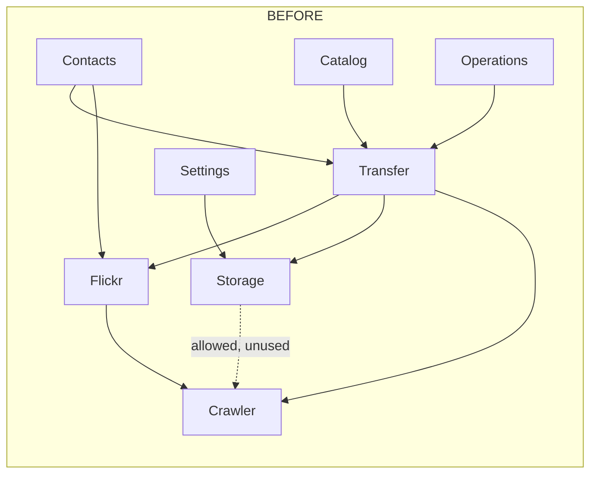
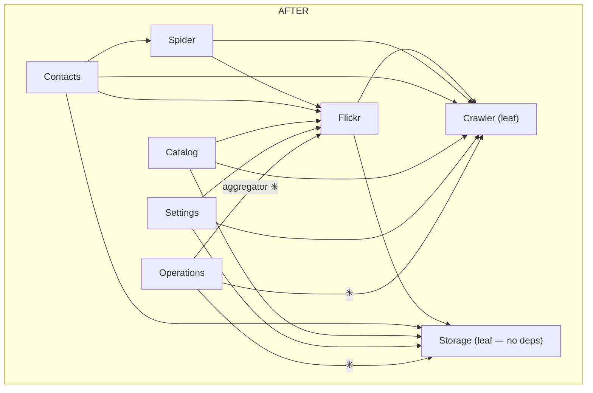
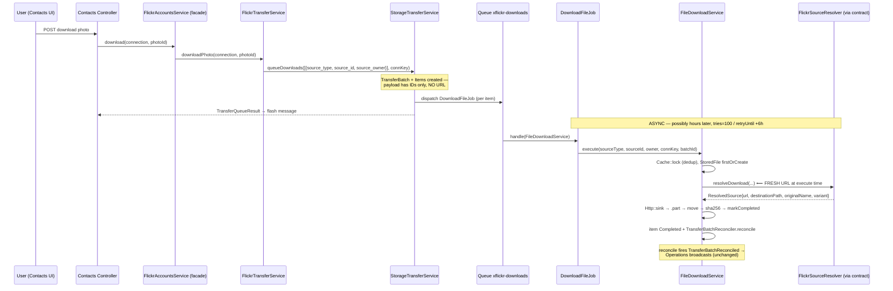
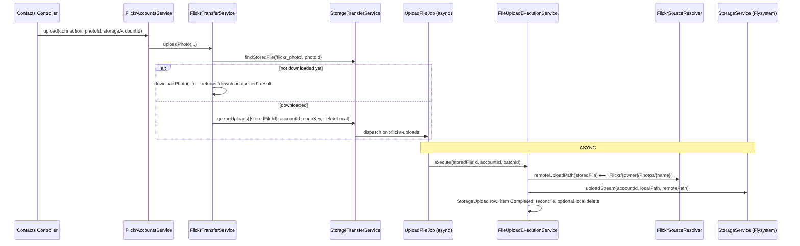

# Implementation Plan — Module Boundary Refactor: Transfer → Storage + Flickr (v2)

- **Date:** 2026-07-14
- **Author:** Claude Code (Senior Software Architect pass)
- **Supersedes:** `~/.cursor/plans/module_boundary_refactor_c3922863.plan.md` (v1)
- **Audit basis:** [`audit_20260714.md`](audit_20260714.md) — fixes C1–C4 and applies all §7 recommendations
- **Principles:** SOLID, DRY, KISS, YAGNI · refactoring.guru patterns · Laravel standards (alexeymezenin, Spatie, project `AGENTS.md`)

---

## 1. WHY (unchanged from v1, verified against source)

A developer must know **three** modules to ship one download/upload feature
(Flickr resolves URLs, Transfer orchestrates, Storage writes to cloud).
`Transfer` is an implementation detail exposed as a public module boundary —
a Single Responsibility violation at module granularity.

**Goals:**

| Module | Target role |
|---|---|
| **Crawler** | Leaf — Flickr API interaction, catalog tables (unchanged) |
| **Storage** | **True leaf** — ALL generic file I/O: download-from-URL, upload-to-cloud, batch/item tracking, stored-file registry. Knows `source_type`/`source_id` strings, never "photo" or "Flickr" |
| **Flickr** | Orchestrator — owns the photo/photoset/gallery domain; tells Storage *what* to move; module facade (`FlickrAccountsService`) is the single entry point for consumers |
| **Transfer** | **Deleted** |

**Non-goals (YAGNI guard):** no multi-source registry (one resolver binding
suffices until a second source type exists), no synchronous public download
API, no transport-adapter layer, no table renames.

## 2. Key design decisions (delta from v1)

Each decision maps to an audit finding.

| # | Decision | Fixes | Rationale |
|---|---|---|---|
| **D1** | Fan-out job lives in **Flickr** (`Flickr/Jobs/FanOutTransferJob`), not Storage | C1 | It injects domain services + connection repos. Storage owning it creates a `Storage → Flickr` cycle |
| **D2** | **Lazy resolution via contract**: `Storage/Contracts/TransferSourceResolver`, implemented by `Flickr/Services/FlickrSourceResolver`, bound in `FlickrServiceProvider` (Dependency Inversion / Strategy pattern) | C2, C4 | Download URL is resolved **inside the job at execution time** — preserves fresh URLs across the 6h retry window, spreads `flickr.photos.getSizes` calls over the queue instead of bursting at enqueue, and keeps retry working from Storage without knowing Flickr |
| **D3** | The same contract provides `remoteUploadPath(StoredFile)` | C4 | Remote path is `Flickr/{owner}/Photos/{name}` today (`PhotoUploadExecutionService:69`) — domain knowledge; Storage must not hardcode it |
| **D4** | Rename `flickr_photo_id → source_id` on **both** `stored_files` **and** `transfer_items`; retry route param `{flickrPhotoId} → {sourceId}`; update the 2 affected TS types in the same phase | C3 | Half-generic is worse than either extreme; the API/TS surface is small (verified: 1 endpoint, 2 `types.ts` fields) |
| **D5** | **No** `DownloadAdapter` / `GuzzleDownloadAdapter` / `DownloadResult` / `downloadFromUrl()` / `name()`. `FileDownloadService` calls `Http::sink()` directly | YAGNI | One transport, no second on the roadmap, `Http::fake()` covers tests. Extract an interface when a second transport exists |
| **D6** | `StorageService` facade **unchanged**. New, separate `StorageTransferService` facade for queueing/stored-file queries; `TransferQueryService` + `TransferItemRetryService` merge into one `TransferProgressService` | SRP/ISP | Prevents the god-facade; progress query+retry serve the same controller and share batch/item invariants |
| **D7** | `TransferProgressController` (+ its routes, requests, resources) moves to **Flickr**, not Storage | audit §7.8 | The API is `flickr/accounts/{connection}/transfers*` and binds `Crawler\Connection` — per-connection domain progress. Consequence: **Storage drops its Crawler dependency entirely** (verified: zero `Modules\Crawler` imports exist in `Storage/app` today) and becomes a true leaf |
| **D8** | Merge `TransferRuntimeConfig` + `DownloadRuntimeConfig` → one `Storage/Support/TransferRuntimeConfig`; merge `PhotoDownloadService` + `PhotoUploadService` domain halves → one `FlickrTransferService` | DRY, fewer classes | Both configs read the same config file; both services share grouping/dedup/queueing shape |
| **D9** | Backward compat via a single `Modules/Transfer/alias.php` (composer `files` autoload) holding every `class_alias(old, new)`; deleted in the final phase **after a queue drain** | audit §5.4 | Old serialized job payloads / `failed_jobs` rows keep unserializing across intermediate deploys; one file to delete at the end |
| **D10** | Precondition phase: land `feat/fe-ui-ux-polish` first | audit §5.7 | 10+ Transfer files are currently uncommitted; the refactor must start from a clean base |

## 3. Target architecture

### 3.1 Module DAG — before / after





Final allowlist (goes into `ModuleDependencyDirectionTest::ALLOWED` **and** `deptrac.yaml`):

```
Auth       → []
Crawler    → []
Storage    → []                                  # was [Crawler] — edge was never used
Flickr     → [Crawler, Storage]                  # + Storage (new)
Spider     → [Flickr, Crawler]
Contacts   → [Flickr, Spider, Storage, Crawler]  # Transfer → {Flickr facade, Storage repos}
Catalog    → [Flickr, Storage, Crawler]          # Transfer → Storage
Settings   → [Flickr, Storage, Crawler]          # unchanged (never used Transfer)
Operations → [*]
```

> The one runtime coupling that crosses "against" an arrow is the container
> binding `TransferSourceResolver → FlickrSourceResolver`, registered by
> **Flickr's** provider. Storage compiles standalone; it just cannot *execute*
> transfer jobs without some module providing the binding. This is standard
> DIP (ports & adapters) and is what keeps resolution lazy without a cycle.

### 3.2 Responsibility split (who knows what)

| Concern | Owner |
|---|---|
| Which photos belong to a contact / photoset / gallery; grouping; dedup against catalog | Flickr (`FlickrTransferService`) |
| Resolving a fresh download URL (`flickr.photos.getSizes`), destination path, original name | Flickr (`FlickrSourceResolver`, called via Storage contract) |
| Remote cloud path convention (`Flickr/{owner}/Photos/{name}`) | Flickr (`FlickrSourceResolver::remoteUploadPath`) |
| Batch/item lifecycle, dedup lock, `.part` download, sha256, reconcile, retry, progress query, streaming local files | Storage |
| Raw cloud write (Flysystem), accounts, quotas, browse | Storage (unchanged services) |
| UI entry points (queue a download/upload for a photo/contact) | Contacts → `FlickrAccountsService` facade only |

## 4. Code structure

### 4.1 Storage module (after)

```
Modules/Storage/app/
├── Contracts/
│   ├── StorageBrowseDriver.php            # unchanged
│   ├── StorageDeleteDriver.php            # unchanged
│   ├── StorageDownloadStreamer.php        # unchanged
│   └── TransferSourceResolver.php         # NEW (D2/D3) — the only new abstraction
├── Dto/
│   ├── ... (existing unchanged)
│   ├── TransferQueueResult.php            # moved from Transfer
│   └── ResolvedSource.php                 # NEW — resolver output
├── Enums/
│   ├── ... (existing unchanged)
│   ├── StoredFileStatus.php               # moved
│   ├── TransferBatchStatus.php            # moved
│   ├── TransferItemStatus.php             # moved
│   ├── TransferType.php                   # moved
│   └── TransferExecutionOutcome.php       # moved + renamed (was PhotoTransferExecutionOutcome)
├── Events/
│   ├── ... (existing unchanged)
│   └── TransferBatchReconciled.php        # moved
├── Http/Controllers/Api/V1/
│   ├── ... (existing unchanged)
│   └── StoredFileController.php           # moved (uuid-keyed, already generic)
├── Jobs/
│   ├── DownloadFileJob.php                # moved + renamed (was DownloadPhotoJob)
│   └── UploadFileJob.php                  # moved + renamed (was UploadPhotoJob)
│                                          # NOTE: FanOut job does NOT move here (D1)
├── Models/
│   ├── ... (existing unchanged)
│   ├── StoredFile.php                     # moved + genericized (D4)
│   ├── TransferBatch.php                  # moved as-is
│   └── TransferItem.php                   # moved + genericized (D4)
├── Repositories/
│   ├── ... (existing unchanged)
│   ├── StoredFileRepository.php           # moved; keys become (sourceType, sourceId)
│   ├── TransferBatchRepository.php        # moved as-is
│   └── TransferItemRepository.php         # moved; keys become sourceId
├── Services/
│   ├── ... (15 existing services unchanged; StorageService NOT extended — D6)
│   ├── StorageTransferService.php         # NEW facade: queueDownloads/queueUploads/findStoredFile/completedSourceIds
│   ├── FileDownloadService.php            # from PhotoDownloadExecutionService, Flickr bits extracted (D2, D5)
│   ├── FileUploadExecutionService.php     # from PhotoUploadExecutionService, path via resolver (D3)
│   ├── TransferBatchReconciler.php        # moved as-is
│   ├── TransferProgressService.php        # merge of TransferQueryService + TransferItemRetryService (D6)
│   └── StoredFileStreamService.php        # moved as-is
└── Support/
    └── TransferRuntimeConfig.php          # merge of TransferRuntimeConfig + DownloadRuntimeConfig (D8)
```

### 4.2 Flickr module (after)

```
Modules/Flickr/app/
├── Http/
│   ├── Controllers/Api/V1/
│   │   └── TransferProgressController.php # moved from Transfer (D7)
│   ├── Requests/Api/
│   │   └── ListTransferBatchesRequest.php # moved from Transfer
│   └── Resources/
│       ├── TransferBatchResource.php          # moved
│       ├── TransferBatchDetailResource.php    # moved
│       └── TransferRetryAcceptedResource.php  # moved
├── Jobs/
│   └── FanOutTransferJob.php              # moved + renamed (was FanOutTransferBatchJob) (D1)
├── Services/
│   ├── FlickrAccountsService.php          # extended: download/upload/…ForContacts delegation
│   ├── FlickrTransferService.php          # NEW — merge of PhotoDownloadService + PhotoUploadService domain logic (D8)
│   ├── FlickrSourceResolver.php           # NEW — implements Storage\Contracts\TransferSourceResolver (D2/D3)
│   ├── FlickrPhotoSizeResolver.php        # unchanged (already correct home)
│   └── ... (existing unchanged)
└── routes/api.php                         # + transfer progress routes (URIs unchanged)
```

### 4.3 Deleted

```
Modules/Transfer/                          # entire module, final phase
  (interim: only alias.php + composer.json remain during phases 1–6)
```

### 4.4 Consumers (imports only — no behavior change)

| File | Change |
|---|---|
| `Contacts/PhotoDownloadController`, `Contacts/PhotoUploadController` | inject `FlickrAccountsService` instead of `PhotoDownload/UploadService` |
| `Contacts/ContactStatsService`, `Contacts/ContactListSorter` | `Transfer\Repositories\*` → `Storage\Repositories\*`, enums likewise |
| `Catalog/PhotoCatalogPresenter` | `Transfer\{Models,Repositories,Enums}` → `Storage\*` |
| `Operations/SnapshotService` | `TransferQueryService` → `Storage\Services\TransferProgressService` |
| `Operations/EventServiceProvider`, `BroadcastOperationsBatchUpdated` | event namespace → `Storage\Events\TransferBatchReconciled` |
| `app/Providers/RepositoryServiceProvider` | 3 repo bindings → Storage namespaces |
| `app/Http/Middleware/HandleInertiaRequests` | `Transfer\Support\TransferRuntimeConfig` → `Storage\Support\…` |
| `database/seeders/DemoDatasetSeeder` + factories | namespaces |
| `resources/js/types.ts` (+ `TransferBatchPanel`, item cells) | `flickr_photo_id` → `source_id` on transfer-item types (D4 only) |

## 5. Contracts & skeletons

### 5.1 The one new abstraction — `TransferSourceResolver` (DIP / Strategy)

```php
<?php

declare(strict_types=1);

namespace Modules\Storage\Contracts;

use Modules\Storage\Dto\ResolvedSource;
use Modules\Storage\Models\StoredFile;

/**
 * Port implemented by the domain module that owns a source_type.
 * Bound by the owning module's service provider (Flickr today).
 * Called lazily at JOB EXECUTION time so URLs are always fresh.
 */
interface TransferSourceResolver
{
    public function resolveDownload(
        string $sourceType,
        string $sourceId,
        string $sourceOwner,
        string $connectionKey,
    ): ResolvedSource;

    public function remoteUploadPath(StoredFile $file): string;
}
```

```php
<?php

declare(strict_types=1);

namespace Modules\Storage\Dto;

final readonly class ResolvedSource
{
    /** @param array<string, mixed> $metadata */
    public function __construct(
        public string $url,
        public string $destinationPath,   // e.g. flickr/{owner}/photos/{id}_{secret}.{ext}
        public string $originalName,
        public string $variant,
        public array $metadata = [],
    ) {}
}
```

> **Future multi-source note (documented, not built — YAGNI):** when a second
> `source_type` appears, replace the single binding with a
> `TransferSourceResolverRegistry` keyed by `source_type`. The interface does
> not change.

### 5.2 Flickr implementation

```php
<?php

declare(strict_types=1);

namespace Modules\Flickr\Services;

use App\Repositories\Crawler\ConnectionQueryRepository;
use App\Repositories\Crawler\PhotoQueryRepository;
use Modules\Flickr\Support\FlickrPhotoUrlHelper;
use Modules\Storage\Contracts\TransferSourceResolver;
use Modules\Storage\Dto\ResolvedSource;
use Modules\Storage\Models\StoredFile;
use RuntimeException;

final class FlickrSourceResolver implements TransferSourceResolver
{
    public const SOURCE_TYPE = 'flickr_photo';

    public function __construct(
        private readonly FlickrAccountsService $flickr,
        private readonly ConnectionQueryRepository $connections,
        private readonly PhotoQueryRepository $photos,
    ) {}

    public function resolveDownload(
        string $sourceType,
        string $sourceId,
        string $sourceOwner,
        string $connectionKey,
    ): ResolvedSource {
        $connection = $this->connections->findByConnectionKey($connectionKey)
            ?? throw new RuntimeException("Flickr connection [{$connectionKey}] was not found.");
        $photo = $this->photos->findByFlickrPhotoId($sourceId)
            ?? throw new RuntimeException("Photo [{$sourceId}] was not found in catalog.");

        $candidate = $this->flickr->resolvePhotoSize($sourceId, $connection); // fresh URL, execute-time
        $extension = FlickrPhotoUrlHelper::resolveExtension(
            $candidate->url,
            is_array($photo->raw_payload) ? ($photo->raw_payload['originalformat'] ?? null) : null,
        );
        $secret = $photo->secret ?? 'unknown';

        return new ResolvedSource(
            url: $candidate->url,
            destinationPath: "flickr/{$sourceOwner}/photos/{$sourceId}_{$secret}.{$extension}",
            originalName: FlickrPhotoUrlHelper::originalNameFor($sourceId, $extension),
            variant: $candidate->variant,
            metadata: ['download_variant' => $candidate->variant, 'sizes_source' => 'flickr.photos.getSizes'],
        );
    }

    public function remoteUploadPath(StoredFile $file): string
    {
        $extension = FlickrPhotoUrlHelper::resolveExtension((string) $file->local_path);

        return 'Flickr/'.$file->source_owner.'/Photos/'
            .FlickrPhotoUrlHelper::originalNameFor($file->source_id, $extension);
    }
}
```

```php
// Modules/Flickr/app/Providers/FlickrServiceProvider.php  (register())
$this->app->bind(
    \Modules\Storage\Contracts\TransferSourceResolver::class,
    \Modules\Flickr\Services\FlickrSourceResolver::class,
);
```

### 5.3 Storage — execution service (absorbs `PhotoDownloadExecutionService`)

```php
<?php

declare(strict_types=1);

namespace Modules\Storage\Services;

use Illuminate\Support\Facades\Cache;
use Illuminate\Support\Facades\Http;
use Illuminate\Support\Facades\Storage;
use Modules\Storage\Contracts\TransferSourceResolver;
use Modules\Storage\Enums\StoredFileStatus;
use Modules\Storage\Enums\TransferExecutionOutcome;
use Modules\Storage\Enums\TransferItemStatus;
use Modules\Storage\Repositories\StoredFileRepository;
use Modules\Storage\Repositories\TransferItemRepository;
use Modules\Storage\Support\TransferRuntimeConfig;

final class FileDownloadService
{
    public function __construct(
        private readonly TransferSourceResolver $sources,      // ← the only domain touchpoint
        private readonly TransferBatchReconciler $reconciler,
        private readonly StoredFileRepository $storedFiles,
        private readonly TransferItemRepository $items,
        private readonly TransferRuntimeConfig $config,
    ) {}

    public function execute(
        string $sourceType,
        string $sourceId,
        string $sourceOwner,
        string $connectionKey,
        ?int $batchId,
    ): TransferExecutionOutcome {
        $lock = Cache::lock("download_lock:{$sourceType}:{$sourceId}", 120);
        if (! $lock->get()) {
            return TransferExecutionOutcome::Deferred;      // job self-releases +10s (unchanged semantics)
        }

        $partPath = null;

        try {
            $storedFile = $this->storedFiles->firstOrCreateOriginal($sourceType, $sourceId, $sourceOwner);

            if ($storedFile->status === StoredFileStatus::Completed->value) {
                $this->completeItem($batchId, $sourceId);

                return TransferExecutionOutcome::Completed;
            }

            $this->storedFiles->markDownloading($sourceType, $sourceId);
            $this->items?->updateStatus($batchId, $sourceId, TransferItemStatus::Processing);

            $resolved = $this->sources->resolveDownload($sourceType, $sourceId, $sourceOwner, $connectionKey);
            $partPath = "{$resolved->destinationPath}.part";

            $this->downloadTo($resolved, $partPath);                 // Http::sink → .part → move → sha256 (D5: no adapter layer)
            $partPath = null;

            $this->completeItem($batchId, $sourceId);

            return TransferExecutionOutcome::Completed;
        } catch (\Exception $e) {
            if ($partPath !== null && Storage::exists($partPath)) {
                Storage::delete($partPath);
            }
            $this->storedFiles->markPending($sourceType, $sourceId, $e->getMessage());
            $this->items?->updateStatus($batchId, $sourceId, TransferItemStatus::Processing, $e->getMessage());

            throw $e;                                                // queue backoff/tries unchanged
        } finally {
            $lock->release();
        }
    }

    public function handleFailure(string $sourceType, string $sourceId, ?int $batchId, string $error): void
    {
        // markFailed + item Failed + reconcile — verbatim from PhotoDownloadExecutionService::handleFailure
    }

    private function downloadTo(ResolvedSource $resolved, string $partPath): void { /* verbatim persistStoredFile() body */ }

    private function completeItem(?int $batchId, string $sourceId): void { /* markCompleted + reconcile */ }
}
```

### 5.4 Storage — jobs (payload carries **IDs only**, never URLs)

```php
<?php

declare(strict_types=1);

namespace Modules\Storage\Jobs;

final class DownloadFileJob implements ShouldQueue
{
    use Dispatchable; use InteractsWithQueue; use Queueable; use SerializesModels;

    public int $tries = 100;
    public int $maxExceptions = 3;
    public int $backoff = 30;

    public function __construct(
        private readonly string $sourceType,
        private readonly string $sourceId,
        private readonly string $sourceOwner,
        private readonly string $connectionKey,
        private readonly ?int $batchId = null,
    ) {
        $this->onQueue('xflickr-downloads');       // unchanged — no Horizon change
    }

    public function retryUntil(): DateTime { return now()->addHours(6)->toDateTime(); }

    public function handle(FileDownloadService $service): void
    {
        $outcome = $service->execute($this->sourceType, $this->sourceId, $this->sourceOwner, $this->connectionKey, $this->batchId);

        if ($outcome === TransferExecutionOutcome::Deferred) {
            $this->release(10);
        }
    }

    public function failed(Throwable $e): void
    {
        app(FileDownloadService::class)->handleFailure($this->sourceType, $this->sourceId, $this->batchId, $e->getMessage());
    }
}
```

`UploadFileJob(storedFileId, storageAccountId, batchId, …)` mirrors today's
`UploadPhotoJob`; `FileUploadExecutionService` computes the remote path via
`$this->sources->remoteUploadPath($storedFile)` instead of importing
`FlickrPhotoUrlHelper`. Retry re-derives everything from the `StoredFile`
row, so `TransferProgressService::retry()` works without Flickr knowledge.

### 5.5 Storage — public facade (D6: separate from `StorageService`)

```php
<?php

declare(strict_types=1);

namespace Modules\Storage\Services;

/**
 * Public API of Storage's transfer capability (Facade pattern).
 * Item payloads carry source identity only — resolution is lazy (D2).
 */
final class StorageTransferService
{
    public function __construct(
        private readonly TransferBatchRepository $batches,
        private readonly TransferItemRepository $items,
        private readonly StoredFileRepository $storedFiles,
    ) {}

    /**
     * @param list<array{source_type: string, source_id: string, source_owner: string}> $items
     */
    public function queueDownloads(
        array $items,
        string $connectionKey,
        ?string $groupType = null,
        ?string $groupId = null,
        ?string $groupLabel = null,
    ): TransferQueueResult {
        // create TransferBatch(+Items, dedup vs completed StoredFiles),
        // dispatch DownloadFileJob per item — extracted verbatim from
        // PhotoDownloadService::queuePhotoDownloads()/queueSelectedDownloads()
    }

    /** @param list<int> $storedFileIds */
    public function queueUploads(
        array $storedFileIds,
        int $storageAccountId,
        string $connectionKey,
        ?bool $deleteLocalAfterUpload = null,
    ): TransferQueueResult { /* from PhotoUploadService::queueUploads() */ }

    public function findStoredFile(string $sourceType, string $sourceId): ?StoredFile;

    /** @return list<string> subset of $sourceIds with a Completed StoredFile */
    public function completedSourceIds(string $sourceType, array $sourceIds): array;
}
```

`TransferProgressService` (merged query + retry, D6) — all methods take
`string $connectionKey`, **not** `Connection` (this is what makes Storage a
leaf):

```php
final class TransferProgressService
{
    public function index(string $connectionKey, ?string $status, ?string $type, ?bool $isActive, string $sort, string $direction, int $limit): array;
    public function show(string $connectionKey, TransferBatch $batch): ?array;
    public function retry(string $connectionKey, TransferBatch $batch, string $sourceId): void;  // re-dispatches Download/UploadFileJob
}
```

### 5.6 Flickr — domain orchestration

```php
<?php

declare(strict_types=1);

namespace Modules\Flickr\Services;

use Modules\Crawler\Models\Connection;
use Modules\Flickr\Jobs\FanOutTransferJob;
use Modules\Storage\Dto\TransferQueueResult;
use Modules\Storage\Services\StorageTransferService;

/**
 * Merge of Transfer\PhotoDownloadService + PhotoUploadService domain halves (D8).
 * Knows photos/contacts/groups; delegates all I/O + tracking to Storage.
 */
final class FlickrTransferService
{
    public function __construct(
        private readonly StorageTransferService $transfers,
        private readonly PhotoQueryRepository $photos,
        private readonly StorageAccountRepository $storageAccounts,
    ) {}

    public function downloadPhoto(Connection $connection, string $flickrPhotoId): TransferQueueResult
    {
        return $this->transfers->queueDownloads(
            items: [$this->itemFor($flickrPhotoId)],          // NO URL — resolved lazily in the job (D2)
            connectionKey: $connection->connection_key,
        );
    }

    public function downloadForContacts(Connection $connection, array $contactNsids): TransferQueueResult
    {
        foreach ($contactNsids as $nsid) {
            FanOutTransferJob::dispatch(TransferType::Download, $connection->connection_key, $nsid);
        }
        // returns queued-result summary (from PhotoDownloadService::queueFromInput)
    }

    public function uploadPhoto(Connection $connection, string $flickrPhotoId, int $storageAccountId, ?bool $deleteLocal = null): TransferQueueResult
    {
        $stored = $this->transfers->findStoredFile(FlickrSourceResolver::SOURCE_TYPE, $flickrPhotoId);

        if ($stored === null || ! $stored->isCompleted()) {
            $this->downloadPhoto($connection, $flickrPhotoId);   // auto-download-before-upload (unchanged UX)

            return TransferQueueResult::info('Download queued; upload it once the download completes.');
        }

        return $this->transfers->queueUploads([$stored->id], $storageAccountId, $connection->connection_key, $deleteLocal);
    }

    public function uploadForContacts(...): TransferQueueResult;   // dispatches FanOutTransferJob(Upload, …)

    /** Called by FanOutTransferJob — chunks catalog photos, filters already-completed
     *  via completedSourceIds(), groups by photoset/gallery/owner, queueDownloads per group. */
    public function fanOutDownloads(Connection $connection, string $ownerNsid): int;
    public function fanOutUploads(Connection $connection, StorageAccount $account, ?string $ownerNsid, ?bool $deleteLocal): int;

    private function itemFor(string $flickrPhotoId): array { /* {source_type, source_id, source_owner} from catalog */ }
}
```

`Flickr/Jobs/FanOutTransferJob` = today's `FanOutTransferBatchJob` verbatim,
with `PhotoDownloadService`/`PhotoUploadService` handles replaced by
`FlickrTransferService`. **It stays in Flickr — no Storage→Flickr edge (D1).**

`FlickrAccountsService` (module facade) gains four one-line delegations:
`download()`, `upload()`, `downloadForContacts()`, `uploadForContacts()` —
so consumer modules (Contacts) keep a single Flickr entry point.

### 5.7 Flickr — progress controller (moved, D7)

```php
// Modules/Flickr/routes/api.php  — URIs IDENTICAL to today (same 'api' prefix + v1 group)
Route::prefix('v1')->group(function (): void {
    Route::prefix('flickr/accounts/{connection}')->group(function (): void {
        Route::get('/transfers', [TransferProgressController::class, 'index']);
        Route::get('/transfers/{batch}', [TransferProgressController::class, 'show']);
        Route::post('/transfers/{batch}/items/{sourceId}/retries', [TransferProgressController::class, 'retryItem']); // param renamed (D4)
    });
});
// /api/v1/stored-files/{uuid} → Modules/Storage/routes/api.php (StoredFileController)
```

The controller resolves `Connection` (Flickr's job) and passes
`$connection->connection_key` strings into `TransferProgressService`.

## 6. Data model changes (Phase 3 — the only schema phase)

Two migrations, deployed together:

```php
// 1) schema: 2026_XX_XX_000100_genericize_stored_files_and_transfer_items.php
public function up(): void
{
    Schema::table('stored_files', function (Blueprint $table): void {
        $table->string('source_type', 32)->default('flickr_photo')->after('uuid');
        $table->renameColumn('flickr_photo_id', 'source_id');
        $table->renameColumn('owner_nsid', 'source_owner');
    });

    Schema::table('stored_files', function (Blueprint $table): void {
        $table->dropUnique(['flickr_photo_id', 'variant']);          // old composite scope
        $table->dropIndex(['flickr_photo_id']);
        $table->dropIndex(['owner_nsid']);
        $table->unique(['source_type', 'source_id', 'variant']);     // new uniqueness scope
        $table->index(['source_type', 'source_id']);
        $table->index('source_owner');
    });

    Schema::table('transfer_items', function (Blueprint $table): void {
        $table->renameColumn('flickr_photo_id', 'source_id');        // D4 — full generic, not half
    });
}
```

```php
// 2) data backfill: dedup_key format {source_type}:{source_id}:{variant}  (fits 64 chars)
DB::table('stored_files')->orderBy('id')->chunkById(1000, function ($rows): void {
    foreach ($rows as $row) {
        DB::table('stored_files')->where('id', $row->id)->update([
            'dedup_key' => "flickr_photo:{$row->source_id}:{$row->variant}",
        ]);
    }
});
```

- MySQL 8 `RENAME COLUMN` preserves data and existing single-column indexes;
  the composite unique **must** be dropped/recreated because its scope changes
  (audit §5.2). Run against a test-DB snapshot first (never the dev Docker
  stack — `AGENTS.md` Docker policy).
- `down()` reverses renames + indexes; the dedup backfill's `down()` restores
  the old format.
- Tables are **not** renamed (`transfer_batches` / `transfer_items` /
  `stored_files` are already generic names) — zero-risk on data, and model
  names may differ from table names without violating any Laravel convention.

## 7. Runtime flows (after)

### 7.1 Download — resolution stays lazy (fixes C2)



### 7.2 Upload — auto-download-before-upload preserved



### 7.3 Retry (works from Storage — no Flickr import)

`POST /api/v1/flickr/accounts/{connection}/transfers/{batch}/items/{sourceId}/retries`
→ Flickr `TransferProgressController` → Storage `TransferProgressService::retry()`
→ re-dispatch `DownloadFileJob`/`UploadFileJob` with IDs from the batch/item
rows. Because the job resolves lazily via the contract, retry needs zero
domain knowledge. (Today this path imports `PhotoQueryRepository` to
re-derive `owner_nsid`; after D4, `source_owner` is read from the
`StoredFile`/batch rows instead — one less host-app import.)

## 8. Phased execution

Each phase = one PR into `develop`, independently deployable, green on
`bash scripts/test.sh gate:ci` (incl. 95% coverage floor), `npm run check`,
`composer lint` (pint + phpstan + **deptrac**).

### Phase 0 — Preconditions (no refactor code)
- Land/merge `feat/fe-ui-ux-polish` (touches 10+ Transfer files the refactor moves).
- Fix the untracked migration's future date (`2026_07_15_…`).
- Record baseline: `gate:ci` green, Horizon drained-queue procedure documented.

### Phase 1 — Move data layer to Storage (mechanical, zero logic change)
- Move: 3 models, 3 repositories, 5 enums (rename `PhotoTransferExecutionOutcome → TransferExecutionOutcome` here — it's data-layer), `TransferQueueResult` DTO, `TransferBatchReconciled` event, 3 factories (fix `newFactory()` namespaces), module tests.
- Create `Modules/Transfer/alias.php` (composer `files` autoload) with `class_alias` for every moved FQCN (D9).
- Update all consumer imports for these classes (Contacts stats/sorter, Catalog presenter, Operations listeners, `RepositoryServiceProvider`, seeders).
- **Gate:** full CI; grep proves no non-alias `Modules\Transfer\{Models,Repositories,Enums,Dto,Events}` references remain.

### Phase 2 — Move plumbing services to Storage (still zero logic change)
- Move as-is: `TransferBatchReconciler`, `StoredFileStreamService`, `StoredFileController` + `/stored-files/{uuid}` route.
- Merge: `TransferQueryService` + `TransferItemRetryService` → `TransferProgressService`; `TransferRuntimeConfig` + `DownloadRuntimeConfig` → `Storage\Support\TransferRuntimeConfig` (aliases for all old names).
- Update `HandleInertiaRequests`, `Operations\SnapshotService`.
- **Gate:** CI + manually exercise `/api/v1/stored-files/{uuid}` and transfers panel.

### Phase 3 — Genericize schema + API surface (D4)
- Migrations from §6 (schema + backfill). Run on test DB snapshot first.
- `StoredFile`/`TransferItem` models, `StoredFileRepository`/`TransferItemRepository` method keys → `(sourceType, sourceId)`.
- Retry route param `{flickrPhotoId} → {sourceId}`; API resources emit `source_id`.
- Frontend: `resources/js/types.ts` (2 fields) + transfer item components; `npm run check`.
- **Gate:** CI + migration up/down on snapshot + transfers panel retry flow.

### Phase 4 — Introduce the contract; genericize execution (D2/D3/D5)
- New: `TransferSourceResolver`, `ResolvedSource`, `FlickrSourceResolver`, provider binding.
- `PhotoDownloadExecutionService` → `FileDownloadService` (Flickr imports replaced by the contract; download body verbatim).
- `PhotoUploadExecutionService` → `FileUploadExecutionService` (remote path via contract).
- `DownloadPhotoJob`/`UploadPhotoJob` → `DownloadFileJob`/`UploadFileJob` (payload: + `sourceType`; aliases keep old payloads deserializable, old `handle()` shims delegate).
- **Gate:** CI + `/verify`-style end-to-end: queue one real download + one upload on dev stack; confirm fresh-URL resolution and unchanged file layout.

### Phase 5 — Domain orchestration into Flickr (D1/D8)
- New `FlickrTransferService` = domain halves of `PhotoDownloadService` + `PhotoUploadService` (grouping, catalog dedup via `completedSourceIds`, auto-download-before-upload).
- New `StorageTransferService` = their queueing halves (batch/item creation + dispatch).
- `FanOutTransferBatchJob` → `Flickr/Jobs/FanOutTransferJob` (alias kept).
- Extend `FlickrAccountsService` facade (4 delegations).
- **Gate:** CI + bulk download-for-contact on dev stack (fan-out → batches → progress).

### Phase 6 — Consumers + guardrails
- Contacts `PhotoDownloadController`/`PhotoUploadController` → `FlickrAccountsService`.
- Move `TransferProgressController` + requests + resources + routes → Flickr (D7). URIs unchanged.
- Update **both** guardrails: `ModuleDependencyDirectionTest::ALLOWED` (+docstring) and `deptrac.yaml` ruleset/comment to the §3.1 allowlist.
- Docs: `docs/00-architecture/modules.md`, `AGENTS.md` module table, `ai/skills/class-purpose-and-module-map`.
- **Gate:** CI; arch test now *rejects* any `Storage → *` module import.

### Phase 7 — Delete Transfer
- Precondition: **drain `xflickr-downloads` / `xflickr-uploads` queues + clear `failed_jobs` retries referencing old FQCNs** (D9).
- Delete `Modules/Transfer/` (incl. `alias.php`), remove from `modules_statuses.json`, `composer dump-autoload`.
- Remove Transfer from CI config/matrices if referenced; `docs-sync` pass.
- **Gate:** full `gate:ci`, `npm run check`, deploy checklist from §9 risks.

## 9. File accounting (the "fewer classes" ledger)

| Change | Δ classes |
|---|---|
| Moves (models, repos, enums, events, jobs, services, controllers, resources) | 0 |
| Merges: 2 photo services → `FlickrTransferService`; query+retry → `TransferProgressService`; 2 runtime configs → 1 | **−3** |
| New: `TransferSourceResolver`, `ResolvedSource`, `FlickrSourceResolver`, `StorageTransferService` | **+4** |
| v1's adapter layer NOT built (`DownloadAdapter`, `GuzzleDownloadAdapter`, `FileDownloadService`-as-orchestrator-plus-adapter, `DownloadResult`) | **−3 vs v1** |
| Deleted Transfer scaffolding: 3 providers, module composer.json/config/routes/statuses entry | **−3 classes, −8 files** |
| **Net vs today** | **−2 classes, one module fewer, one abstraction added (the resolver port)** |

v1 landed at ≈ +1…+3 classes; v2 is net negative while adding the one
abstraction that actually pays rent (lazy resolution + upload path + retry).

## 10. Risks & mitigations

| Risk | Impact | Mitigation |
|---|---|---|
| In-flight queued jobs across phase deploys | `ClassNotFound` on unserialize | `alias.php` covers every moved/renamed FQCN from Phase 1 until Phase 7; queue drain is a hard precondition of Phase 7 only |
| Enqueue-time vs execute-time resolution regression | Flickr API bursts, stale URLs | **Designed out** (D2) — payloads carry IDs; resolver called in-job; `tries/backoff/retryUntil/lock` semantics copied verbatim |
| Column rename + index scope change | Data loss / duplicate rows | `renameColumn()` (no drop+add); composite unique recreated in same migration; rehearse up/down on test-DB snapshot; never on dev Docker stack |
| `dedup_key` backfill on large tables | Long migration | `chunkById(1000)`; format fits the existing 64-char column |
| API field rename `flickr_photo_id → source_id` (items) | Frontend break | Confined to Phase 3, shipped with the TS/type/component updates in the same PR; URIs themselves never change (verified: identical route prefixes) |
| Missing resolver binding (Storage without Flickr) | Container exception in jobs | Acceptable: app always boots Flickr; documented in the contract docblock; a second source type triggers the registry (documented, deferred) |
| 95% coverage floor | Phase fails gate | Tests move with classes in the same PR; new classes (`FlickrSourceResolver`, `StorageTransferService`, `FlickrTransferService`, `TransferProgressService`) get unit tests in their introducing phase |
| Horizon | Jobs unprocessed | Queue names hardcoded and unchanged (`config/horizon.php:203-252`) — verified no change needed |

## 11. Assumptions / open questions

1. **Single-operator deployment** is assumed (self-hosted tool): brief queue
   drain at Phase 7 is acceptable. If not, keep `alias.php` one extra release.
2. `TransferBatch`/`TransferItem`/`StoredFile` **class names stay** (tables
   already generic); only Flickr-*semantic* names were renamed. If a future
   pass wants `Storage\Models\FileTransferBatch`, that is cosmetic and out of
   scope (YAGNI).
3. Contacts reading `Storage` repositories directly (stats/sorter) is accepted
   as UI composition (same pattern as Settings → Storage today). If the team
   prefers strict facade-only access later, add read methods to
   `StorageTransferService` — the DAG already permits it.
